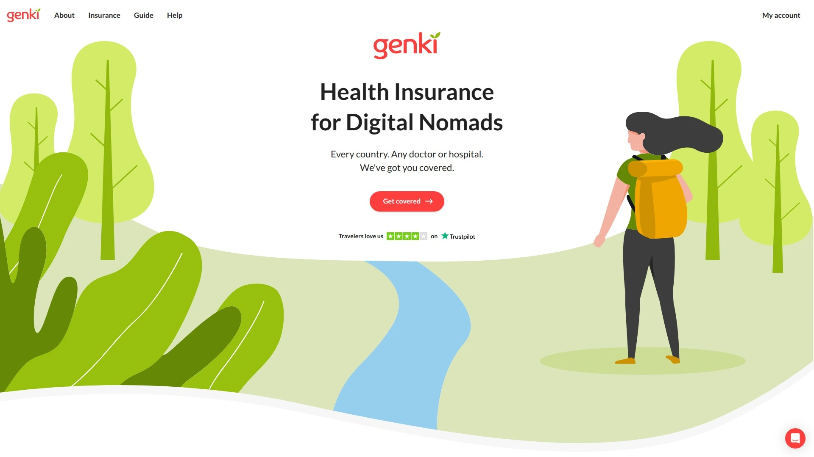
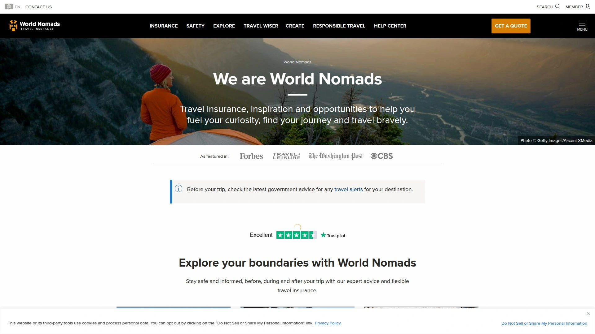
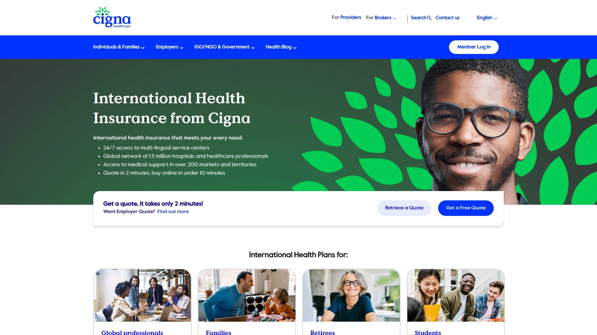
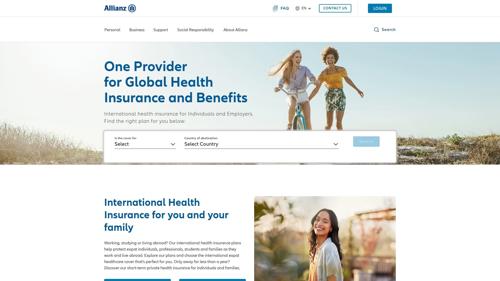
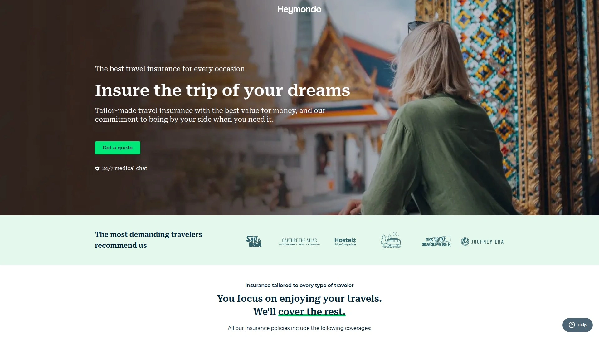
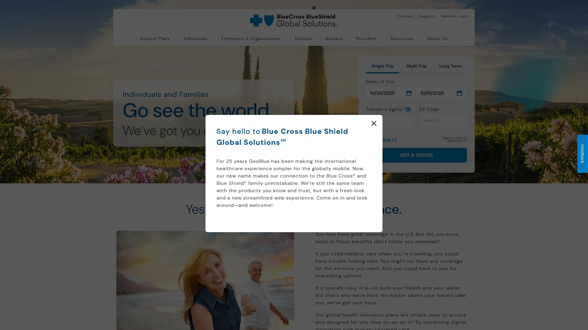
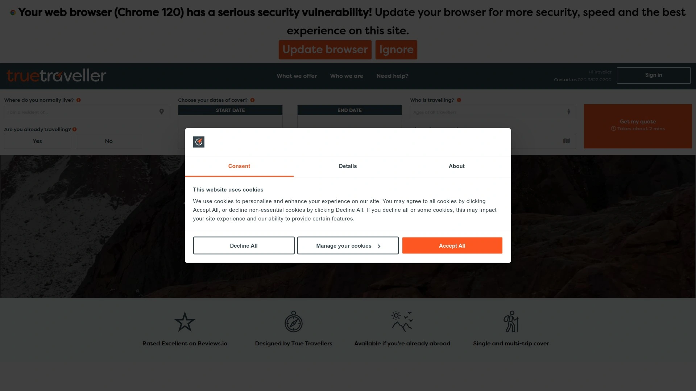
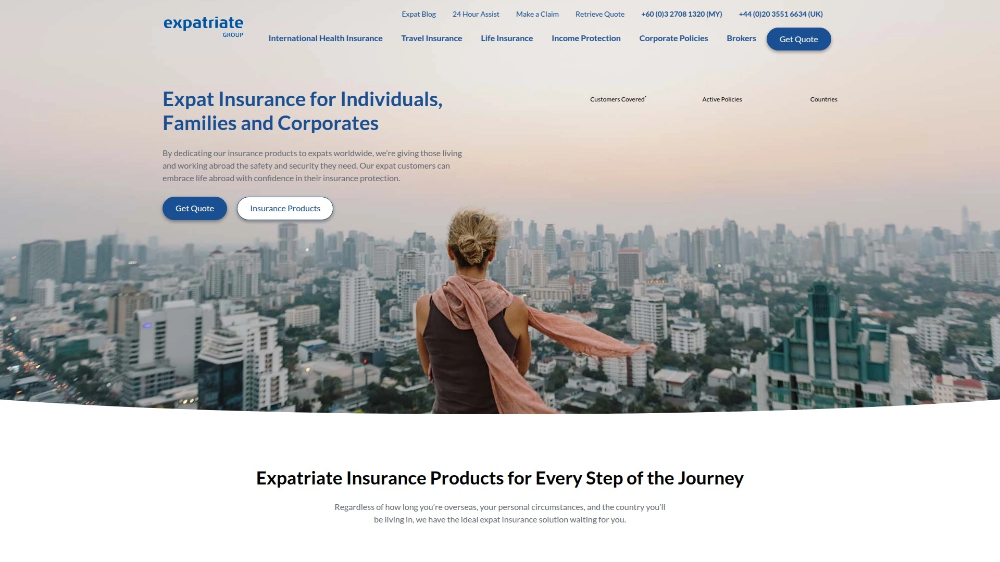

# 2025年十三家全球最佳数字游民保险(旅行医疗保险)

数字游民和长期旅行者最头疼的事情,就是在国外生病或受伤时不知道去哪家医院、担心天价医疗账单、本国保险又不覆盖海外。专业的数字游民健康保险提供全球医疗覆盖、紧急医疗撤离、在线理赔处理,月付模式灵活无需长期合同,让你在150多个国家自由移动时保持医疗保障。无论是预算有限的背包客需要基础急诊保障,还是长期外派的远程工作者要求包含预防保健和慢性病管理的全面计划,这份榜单覆盖从每月60美元到300美元的不同价位,帮你找到最适合旅行方式和健康需求的保险方案。

## **[Genki](https://genki.world)**

专为数字游民打造的灵活健康保险,Allianz和Barmenia双重背书的月付订阅模式。

Genki自成立以来已为全球193个国家的超过5万名数字游民提供保险服务,在Trustpilot上获得4.1分的高评价(近700条评论)。平台由德国Squarelife公司运营,与保险巨头Allianz和Barmenia深度合作,Allianz作为风险承担方,Barmenia提供实际承保服务,确保理赔的可靠性和财务稳定性。

**产品线覆盖三大计划**满足不同阶段的旅行需求。Genki Traveler面向0-69岁任何国籍人士,提供最长12个月的旅行医疗保险,涵盖事故和急诊医疗、医疗撤离、紧急运输和大多数冒险运动,最高赔付110万美元。35岁以下用户每月60美元起,60-69岁191美元,支持在母国每年最多42天的覆盖。

Genki Native分为Basic和Premium两档,属于全面健康保险而非旅行保险。Native Basic月费225美元起,覆盖事故、疾病、慢性病、紧急运输和自由选择医生,最高赔付110万美元。Native Premium月费315美元起,在Basic基础上增加预防保健、有限牙科和视力保健、心理健康和孕产护理,赔付上限无限制。

Genki Resident是最高级别计划,月费329美元起,提供无限额的全球健康覆盖,支持母国每年最多180天,包含完整的牙科、视力、替代疗法和无限制住院康复。这是唯一一个允许数字游民在回家探亲时仍保持大部分覆盖的主流保险计划。

**冒险运动覆盖**是Genki的独特优势,包括攀岩、骑行、潜水、徒步、武术、摩托车骑行、帆船、滑雪和冲浪等大多数运动。合同明确规定"所有未列入排除清单的运动和活动"都受保,这与传统保险公司谨慎的做法形成鲜明对比。

理赔流程全数字化,无需纸质文件或中介,用户在线提交医疗账单后,审核通过的款项会快速通过银行转账返还。没有特定医疗网络限制,可以访问全球任何持证医生、医院或诊所。美国和加拿大的全面覆盖需要额外支付每月63美元,标准计划仅覆盖抵达后首周的紧急医疗。

## **[SafetyWing](https://safetywing.com)**

数字游民保险的开创者,按28天周期自动续订的订阅模式。

SafetyWing成立于2018年,是最早专注数字游民市场的保险公司之一,其Nomad Insurance产品以灵活的订阅模式和合理的价格赢得市场。平台核心理念是将保险变成像Spotify或Netflix一样简单的订阅服务,无需设定结束日期,每28天自动续订直到用户主动取消。

**产品类型**分为Nomad Insurance(旅行医疗保险)和Remote Health(全面健康保险)两类。Nomad Insurance提供最高25万美元的医疗费用覆盖和10万美元的紧急撤离,适合经常移动的数字游民。每个证书周期(28天)有250美元免赔额,旅行延误补偿每天100美元(最多2天),行李丢失最高3000美元。

Remote Health是SafetyWing后来推出的完整健康保险方案,最高覆盖150万美元,适合作为主要保险使用。理赔处理时间承诺10天内完成报销,没有健康预检要求,购买前无需体检。

**母国覆盖政策**为美国公民每90天可在美国停留最多30天,非美国公民每90天可在母国停留15天。这对需要定期回家的数字游民是重要考量,但相比Genki的42-180天显著更短。

冒险运动覆盖包括最高4500米的徒步,这一高度限制高于Heymondo的标准计划。如需覆盖水肺潜水、跳伞或漂流,可以每4周加10美元升级,比竞争对手便宜。COVID-19作为标准医疗覆盖的一部分包含在内,隔离费用每天50美元最多10天。

年龄限制为0-69岁,定价不随国家变化但随年龄调整。可以在已经出国后购买,无需等待期,这对临时决定延长旅行的人非常方便。35%折扣码通过Nomads Embassy等社区可获得。

## **[World Nomads](https://www.worldnomads.com)**

成立于2002年的老牌旅行保险,200多种冒险活动自动覆盖。

World Nomads在旅行保险领域享有盛誉,特别以其对冒险运动的广泛覆盖而闻名。平台提供Standard和Explorer两种单次旅行计划,以及针对外派人士的Expat保险。

**Standard Plan**提供基础覆盖,包括海外医疗费用、医疗撤离、行李和装备保护、旅行取消和中断、恐怖主义事件覆盖,以及海外死亡遣返。Explorer Plan提供更高的保单限额和更多包含的福利,两者都自动覆盖200多种冒险活动,无需单独购买冒险运动豁免书。

覆盖的活动包括水肺潜水(深度根据计划而定)、山地自行车、蹦极、滑水和自由潜水最深60米(Explorer计划)。这对于活跃的旅行者是巨大优势,因为其他保险公司通常需要额外付费才能获得这些覆盖。

**年龄限制**为70岁,意味着可以服务冒险型的老年旅行者,这是相对宽松的标准。提供Silver和Gold两种计划级别,Gold提供更高的医疗费用覆盖和更低的免赔额。

理赔流程要求用户先自付费用,然后提交理赔申请获得报销。在某些情况下如行李延误,World Nomads支付固定的每日金额而非100%覆盖实际费用。不包括任何理由取消(Cancel For Any Reason)保险,即使作为附加选项也不提供。

Reddit社区反馈显示部分用户对World Nomads的理赔处理速度和客服响应不满,特别是在复杂情况下。但对于短期旅行和需要冒险运动覆盖的场景,其产品设计依然具有竞争力。

## **[Insured Nomads](https://insurednomads.com)**

面向远程工作者和全球公民的保险解决方案,附赠机场贵宾室权限。

Insured Nomads将自己定位为"为远程工作者和全球公民设计的保险",产品线涵盖健康保险、旅行保险和旅行取消保障。平台特色在于提供额外福利如机场贵宾室访问权限、实时旅行警报和远程医疗咨询。

**健康保险产品**主要面向长期居住海外且不打算频繁回母国的人群。根据居住地不同,福利略有差异,但一般提供三个主要层级:Connect、ConnectOne和ConnectThree,在某些地区替换为Preferred和Preferred Plus。

所有计划覆盖住院和日间护理福利,包括重症监护、诊断测试、处方药、手术费用和医生费用,最高达保单限额的100%。精神科和心理治疗最多60天。门诊覆盖仅限于肿瘤学、手术、某些诊断扫描和紧急情况,但可以购买额外的门诊模块,提供3000美元(Connect)、5000美元(ConnectOne)或8000美元(ConnectThree)的医生访问、疫苗和处方药覆盖。

牙科急诊仅在住院手术时覆盖,门诊牙科治疗仅ConnectThree计划提供最高1000美元,但有单独的牙科附加模块可购买2000-5000美元的更全面覆盖。孕产模块需要单独购买,在12个月等待期后提供5000或10000美元的怀孕和分娩护理。

**旅行医疗保险**针对短期旅行者,从机场贵宾室访问到危机援助提供全面覆盖。正常运动活动通常包含,但冒险运动如攀岩、蹦极、非指定区域滑雪和深度超过30米的水肺潜水不在覆盖范围内。

COVID-19治疗在旅行保险计划中覆盖,前提是用户没有访问有活跃旅行警告的国家。既往病症大多数保单不自动包含,但有时承保人会在等待期后同意覆盖某些医疗问题。

## **[Cigna Global](https://www.cignaglobal.com)**

全球医疗保险巨头,150万医疗专业人员网络覆盖200多个国家。

Cigna Global是世界知名的国际健康保险提供商,为居住在200多个国家的个人和家庭提供服务。平台使命是改善服务对象的健康、福祉和安全感。

**Global Health计划**提供Silver、Gold和Platinum三个级别。35岁用户的月费分别为266.62美元(Silver)、361.31美元(Gold)和477.72美元(Platinum),可以选择性添加门诊福利(140.42美元)、牙科(88.01美元)等模块。

住院和日间护理费用覆盖最高100万美元(Silver)、200万美元(Gold)或无限制(Platinum)。包括手术、处方药、重症监护、手术费、医生咨询费和单人房住宿。罕见的是,紧急住院牙科没有限额。

高级诊断检查如MRI、CT和PET扫描覆盖最高1万美元(Silver)、1.5万美元(Gold)或无限制(Platinum)。事故和急诊治疗覆盖最高500美元(Silver)、1000美元(Gold)或2000美元(Platinum)。

**康复服务**如物理治疗、职业治疗和言语治疗,Silver计划覆盖5000美元30天,Gold计划1万美元60天,Platinum无限制90天。癌症护理包含在保单最高限额内,但癌症预防手术有1-2万美元限制,癌症相关辅助工具125-500美元。

Cigna通常标准覆盖所有既往病症,但购买前务必确认条款。访问Cigna庞大的国际医疗网络,包括值得信赖的医院、医生和其他医疗专业人员。客户关系团队帮助用户找到最佳医生和医疗设施,在居住国本地医疗系统过于昂贵或服务不足时特别有用。

## **[AXA Global Healthcare](https://www.axaglobalhealthcare.com)**

快速理赔的数字游民医疗保险,80%合格理赔48小时内报销。

AXA Global Healthcare专门为数字游民提供健康保险,其核心卖点是快速的理赔处理和全面的支持服务。平台提供五个级别的覆盖计划,并有可选升级如门诊、牙科和怀孕覆盖,确保用户获得所需保护。

**标准福利**在所有计划中免费提供。急诊覆盖包括过夜住院到救护车运输的全面保障。撤离和遣返服务确保在必要护理不可得时,AXA将用户送到可以获得治疗的地方。

理赔效率是AXA的最大优势,只要提供正确信息,超过80%的合格理赔在48小时内报销。如果理赔预先批准,AXA会直接与医疗提供者结算账单。

**虚拟医生服务**让用户无需寻找当地诊所,可以通过电话或视频聊天预约合格医生,选择适合自己时间和语言。心理健康服务将用户与合格心理学家联系,帮助应对海外生活的挑战。

第二医疗意见服务为任何诊断或治疗计划提供专家审查,无论用户身处世界何处,都能获得所需的充分保证。这些增值服务对于在语言不通或医疗系统陌生的国家旅行的数字游民特别有价值。

## **[Allianz Care](https://www.allianzcare.com)**

Flexicare短期健康保险,适合工作、旅行或临时居住的灵活方案。

Allianz Care是德国保险巨头安联集团的国际健康保险部门,为个人和家庭提供游牧健康保险。Flexicare计划特别为短期需求设计,适合正在工作、旅行或临时居住海外的数字游民和家庭。

**国际健康保险与旅行保险的区别**在于覆盖期限和完整性。外派保险提供更长时期的覆盖和完整健康保障,而旅行保险旨在覆盖短期旅行。Allianz的外派保险计划正是填补这一空白,为需要超过几个月但不是永久定居的人提供解决方案。

Flexicare计划的灵活性体现在可以根据实际需要调整覆盖时长,不需要承诺多年合约。覆盖范围包括医疗咨询、住院治疗、紧急撤离和遣返等核心服务。

作为全球保险巨头,Allianz的医疗网络覆盖广泛,理赔处理流程成熟,财务稳定性无需担忧。但相比Genki或SafetyWing等专注数字游民的初创公司,Allianz的产品可能在定价和用户体验上不够激进。

## **[Heymondo](https://heymondo.com)**

无免赔额的长期旅行保险,最高1000万美元医疗费用覆盖。

Heymondo是一家现代化旅行保险公司,特别擅长为长期旅行者和数字游民提供灵活保单。平台在与SafetyWing的对比中脱颖而出,提供更高的医疗费用上限和无免赔额的优势。

**医疗费用覆盖**最高可达1000万美元,远超SafetyWing的25万美元。这对于可能在医疗费用昂贵的国家(如美国)遇到重大医疗事件的旅行者至关重要。紧急撤离包含在医疗覆盖内,行程取消最高7000美元。

Standard旅行保险不收取免赔额,而SafetyWing每个28天证书周期有250美元免赔额。这意味着小额医疗费用在Heymondo可以完全报销,而SafetyWing需要用户自付前250美元。

**保单灵活性**提供单次旅行、长期停留和年度多次旅行计划,但需要预先选择旅行时长。如果已经在国外,可以中途购买计划,但有72小时等待期。移动应用让用户轻松联系支持、提交理赔和管理保单。

年龄限制为49岁,低于SafetyWing的69岁,这对年长的数字游民是重要限制。冒险运动覆盖作为可选附加项提供,不像SafetyWing标准包含最高4500米徒步。

Heymondo作为葡萄牙数字游民签证申请的推荐保险提供商,提供24/7紧急呼叫功能和专业医疗团队咨询。长期停留保险不仅保护健康,还覆盖行李等财物的丢失或被盗。

## **[GeoBlue](https://www.geobluetravelinsurance.com)**

专注旅行医疗保险的Blue Cross Blue Shield独立授权商。

GeoBlue是Blue Cross Blue Shield协会的独立授权商,与大多数提供综合覆盖的旅行保险公司不同,GeoBlue几乎完全专注于旅行医疗保险计划。这使得GeoBlue成为外派人士或计划长期旅行的家庭和团体的热门选择,他们主要考虑医疗覆盖而不需要其他类型的旅行保险。

**产品线**包括Voyager Choice(单次旅行)、Trekker Choice(一年内多次旅行)和Xplorer(长期旅行)。这些计划提供极高限额的医疗覆盖(最高100万美元)、医疗撤离覆盖、行李和个人物品丢失覆盖、遗体遣返覆盖等。

Voyager Choice单次旅行计划提供5万到100万美元的医疗费用覆盖,免赔额从0到2500美元可选。不包括行程取消和中断覆盖,也不覆盖行程延误或行李延误,因此价格比综合旅行保险便宜。

**Trekker Choice**年度计划覆盖一年内无限次旅行,但每次旅行仅限前70天。这使得Trekker Choice适合全年多次出行但每次约两个月或更短的个人、夫妻或家庭。

Xplorer长期旅行计划提供无限年度和终身医疗最高限额,有既往病症即时覆盖(需要之前覆盖证明),办公室就诊、预防保健和处方药无免赔额。免赔额从1000到10000美元可选,某些类型的覆盖需要共付,可能适用自付费用。

消费者无需通过Blue Cross Blue Shield购买健康保险即可购买GeoBlue计划。Reddit用户反馈GeoBlue理赔体验良好,处理速度快且客服专业。

## **[IMG (International Medical Group)](https://www.imglobal.com)**

成立于1990年的全球保险福利公司,超过60种保险计划覆盖各类场景。

IMG总部位于美国,自1990年成立以来已为全球数百万会员提供服务。作为SiriusPoint公司旗下品牌,IMG是旅行和健康安全解决方案的卓越提供商。

**产品矩阵**超过60种计划,几乎没有IMG保单无法覆盖的情况。保险由SiriusPoint和Crum & Forster承保,前者拥有A-评级,后者拥有A评级(AM Best评级机构)。

核心旅行保险计划包括Patriot International Lite(医疗覆盖5万到100万美元)、Patriot International Platinum(医疗覆盖200万到800万美元)、iTravelInsured系列(Travel Lite/SE/Sport/LX四个级别)。后者包括行程取消和中断覆盖,前者不包括但价格更便宜。

**长期旅行选项**包括Patriot Multi-Trip International(美国公民年度多次出境旅行)和Patriot Multi-Trip America(非美国公民年度多次离开居住国旅行)。这些年度计划对于频繁旅行的数字游民更经济实惠。

覆盖范围广泛,适用于外派人士、船员、传教士、每年多次旅行的人、喜欢冒险运动的人和单次旅行者。几乎所有计划都包括IMG健康保险覆盖,根据计划可以覆盖旅行期间的紧急问题或作为常规医疗保险。

**负面反馈**显示部分用户对IMG Global的理赔拒绝和客服体验不满,Reddit上有帖子建议不要使用。但其他用户指出IMG Bronze对非美国覆盖价格合理。潜在客户应仔细阅读保单条款,特别是排除条款,避免理赔时产生纠纷。

## **[Faye](https://faye.com)**

新一代旅行保险平台,AI驱动的理赔和客户服务体验。

Faye定位为现代化旅行保险提供商,利用人工智能技术优化理赔流程和客户服务。虽然进入市场时间不如World Nomads或Genki长,但其技术优势吸引了追求数字化体验的年轻旅行者。

与World Nomads的对比显示,Faye在某些场景下提供更好的数字体验,但World Nomads在冒险活动覆盖方面更有竞争力。Faye的定价可能对某些长期旅行和冒险活动更贵,但在标准旅行场景下具有竞争力。

**理赔自动化**是Faye的核心卖点,利用AI识别和处理常见理赔类型,加快审核速度减少用户等待时间。移动应用界面现代化,用户可以随时查看保单状态、提交文件和联系客服。

适合重视技术体验、希望理赔流程数字化的年轻数字游民。对于需要广泛冒险运动覆盖或特别长期旅行的用户,Genki或World Nomads可能更合适。

## **[True Traveller](https://www.truetraveller.com)**

英国旅行保险提供商,包含冒险运动和长期背包旅行专属保单。

True Traveller是英国市场知名的旅行保险品牌,为长期背包客和冒险旅行者提供专门设计的保单。平台认识到传统保险公司往往忽视持续数月的背包旅行和参与极限运动的旅行者。

**长期背包旅行保单**允许连续覆盖最多18个月,适合间隔年旅行者和环游世界的背包客。冒险运动覆盖作为标准或附加选项提供,具体取决于所选计划级别。

保单灵活性体现在可以在旅行途中延长覆盖期限,无需回到母国重新购买。欧洲旅行者有专属计划,覆盖欧洲大陆和周边地区的长期旅行。

适合来自英国或欧洲、计划长期背包旅行或间隔年的年轻旅行者。相比美国市场的SafetyWing或Genki,True Traveller在欧洲本土具有更好的认知度和服务网络。

## **[Expatriate Healthcare](https://www.expatriatehealthcare.com)**

灵活的外派旅行保险,单次旅行或年度计划任选。

Expatriate Healthcare专门为外派人士提供旅行保险,覆盖所有国籍、前往世界几乎任何地方的旅行者。可以为特定单次旅行购买保险,或选择年度保单覆盖全年任何出行,无论旅行频率如何。

**核心医疗撤离计划**提供重要的医疗覆盖,对抗高昂的医疗治疗和紧急医疗撤离费用。包括紧急医疗治疗、意外医疗治疗、紧急医疗撤离和遣返。

增强福利作为可选项,针对旅行期间可能遭受的财产、个人责任和意外提供额外保护。包括行李延误和丢失、金钱和文件、旅行延误、非医疗撤离。

**取消和缩短覆盖**保护用户在行程意外取消或被迫提前回家的情况。包括行程取消、提前回家、慈善遣返、治疗和撤离。

不同类型的专门覆盖包括旅行医疗保险(紧急和意外医疗治疗最高100万美元)、非居民旅行保险(为居住在国籍国以外的欧盟或欧洲经济区居民设计)、单程旅行保险(仅覆盖单向出境旅行)。

## 常见问题

**数字游民保险和普通旅行保险有什么区别?**

数字游民保险允许长期连续覆盖(通常12-24个月),支持月付模式无需预设结束日期,并且覆盖更多国家切换场景。Genki和SafetyWing等数字游民保险支持在旅行途中购买和取消,而普通旅行保险通常要求出发前购买且有固定旅行日期。数字游民保险还更多覆盖常规医疗保健和预防护理,而非仅限急诊。普通旅行保险侧重行程取消、行李丢失等旅行风险,数字游民保险侧重持续的健康保障。

**如何选择适合自己的数字游民保险?**

首先明确旅行时长和健康需求。如果只是3-6个月的短期旅行且主要关心急诊,Genki Traveler(60-191美元/月)或SafetyWing Nomad Insurance最经济。需要全面健康保障包括预防保健和慢性病管理的长期数字游民,应选择Genki Native(225-315美元/月)或SafetyWing Remote Health。评估母国覆盖天数需求,Genki Resident提供180天/年而大多数竞争对手仅15-42天。检查是否覆盖计划参与的冒险运动,World Nomads和Genki在这方面最宽松。对比免赔额和理赔流程,Heymondo无免赔额但SafetyWing有250美元。

**既往病症可以投保吗?**

大多数数字游民旅行保险不覆盖既往病症,包括Genki Traveler、SafetyWing Nomad Insurance和World Nomads的标准计划。但Genki Native计划明确包含慢性病覆盖,这是其高级计划的核心优势之一。Cigna Global通常标准覆盖所有既往病症,但需要在购买前确认具体条款。GeoBlue Xplorer计划提供既往病症即时覆盖,需要提供之前覆盖证明。Insured Nomads的既往病症大多数保单不自动包含,但有时承保人会在等待期后同意覆盖某些医疗问题。如果你有慢性病或既往病症需要持续管理,应选择明确覆盖的高级计划如Genki Native或Cigna Global,尽管价格更高但避免理赔时被拒。

## 结语

在众多数字游民健康保险中,**[Genki](https://genki.world)**凭借Allianz和Barmenia的双重背书、月付订阅模式无需长期合约、自动覆盖大多数冒险运动,以及从每月60美元的Traveler基础计划到329美元的Resident全面保障的灵活产品线,特别适合预算和健康需求多样化的数字游民和长期旅行者。平台的全数字化理赔流程、无医疗网络限制和高达180天的母国覆盖(Resident计划),解决了频繁跨国移动者的核心痛点。无论你是刚开始远程工作实验几个月的初级游民,还是已经连续数年环游世界需要包含预防保健和牙科的资深玩家,选择与你旅行频率、目的地医疗成本和风险承受能力匹配的保险计划,才能在全球自由移动时保持健康和财务安全。
